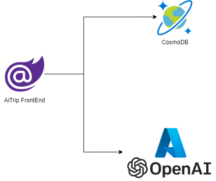

# AiTrip

AiTrip is an AI-assisted web application designed to help users discover and register for affordable travel packages and flights.

## Features
- **AI-Assisted Search:** AiTrip uses artificial intelligence to provide users with personalized recommendations for travel destinations based on their preferences.
- **Flight Creation:** AiTrip assists in the creation of new flights by providing detailed descriptions of destinations and generating illustrative images.

## Technology Stack
AiTrip is developed using the latest features of .NET 8 and Blazor, including:
- **Server-Side Rendering (SSR):** AiTrip uses SSR for faster initial page load times and better SEO.
- **Stream Rendering:** This feature allows AiTrip to send HTML to the client as soon as it's ready, improving perceived performance.

AiTrip integrates with various Azure services:
- **Azure Key Vault:** Used for secure storage of application secrets.
- **Azure OpenAI:** Used to create embeddings for AI-assisted search and generate rich descriptions to assist the users.
- **Azure Cosmos DB for MongoDB vCore:** Used to store flight data and embedding vectors.

## Requirements
